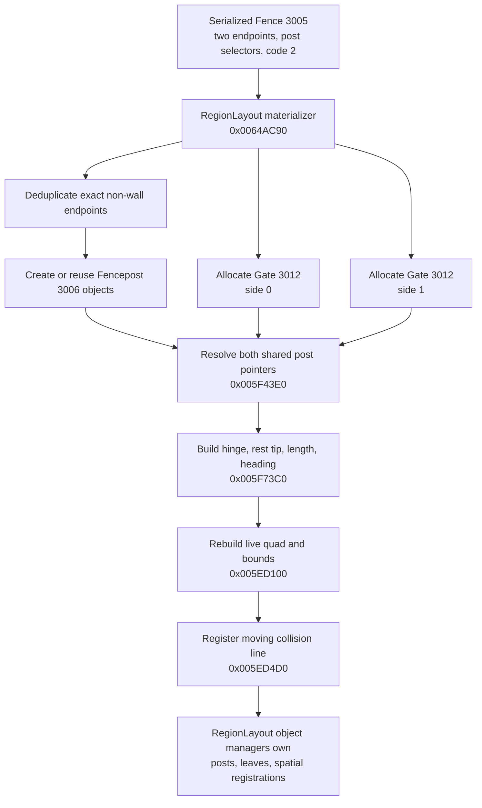
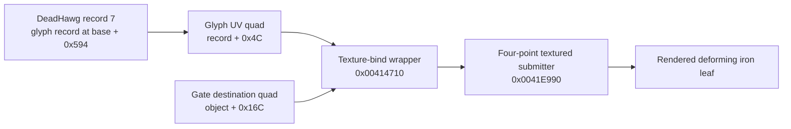
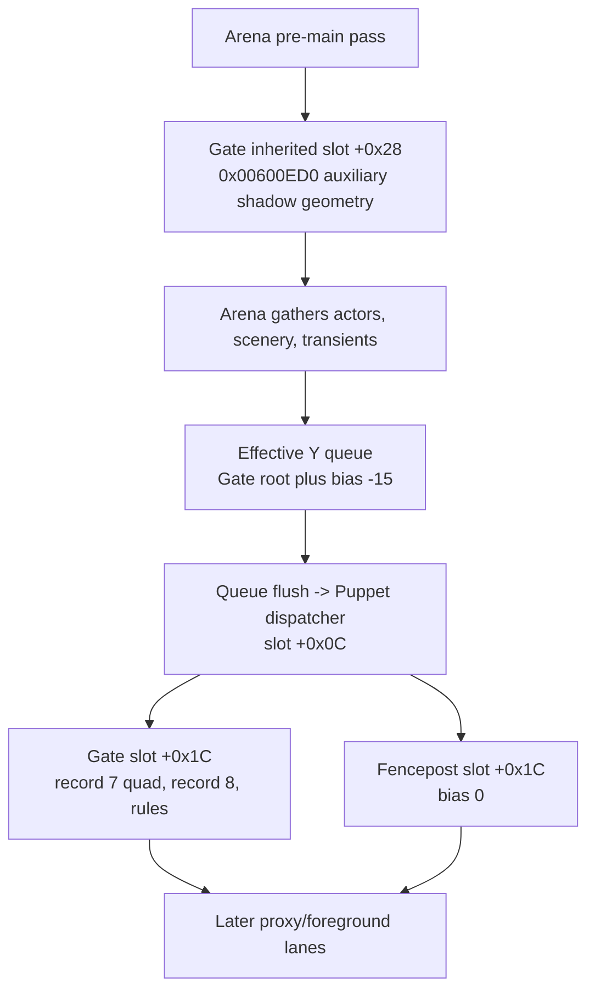
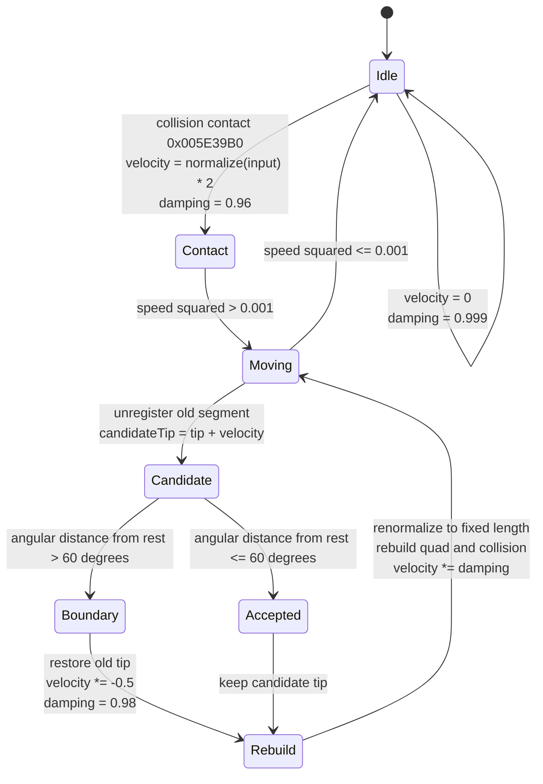
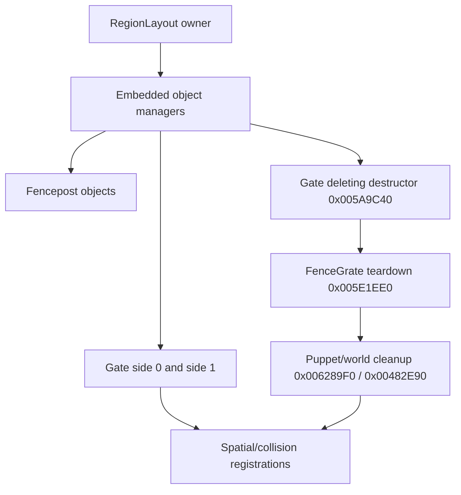
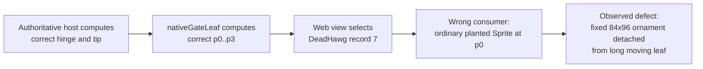

# Native Gate art, geometry, motion, and lifecycle

Date: 2026-08-14

This document is the instruction-level ownership ledger for Boneyard `Gate`
objects (runtime type `3012`). It exists because the large gate ornament was
previously classified as an ordinary atlas sprite. That interpretation is
wrong. Native Solomon Dark maps DeadHawg record 7 across the Gate's four live
geometry points; the art deforms with the moving collision segment.

The central correction is:

```text
wrong:   draw record 7 as an 84x96 sprite at p0
native:  map record 7's full UV rectangle onto [p0, p1, p2, p3]
```

This is a render-consumption defect, not a missing asset, wrong atlas crop,
static-fence geometry defect, painter-order defect, or server-motion defect.

## Evidence ledger

| Claim | Evidence | Confidence | Implementation consequence | Remaining unknown |
| --- | --- | --- | --- | --- |
| Record 7 is a custom textured quadrilateral | `Gate::Render` `0x005ECE40` passes `Gate + 0x16C` and record 7's UV quad at glyph offset `+0x4C` to `0x00414710`; that helper binds the glyph texture and calls four-point submitter `0x0041E990` | High, instruction-proved | The destination must be the live Gate quad, not one planted sprite | None affecting the main leaf |
| Record 8 is an ordinary glyph | `0x005ECE40` calls ordinary glyph painter `0x004143D0` with DeadHawg record 8 at the recovered midpoint | High, instruction-proved | Keep record 8 as a separate sprite | None |
| The four destination points move with the Gate | `Gate::Rebuild` `0x005ED100` rewrites `+0x16C..+0x188` from the current hinge and tip after every accepted motion step | High, instruction-proved | Refresh mesh vertices whenever a snapshot changes the tip | None |
| The web has the correct source images | Extracted record 7 is 84x96 with SHA-256 `da68ac958eb419efa2f442b8a94c00bbd5df9f416f2a6c0ff22cd34fc84d643f`; record 8 is 16x19 with SHA-256 `0c8e94f34cf40b4b1ce94761f43ce9052c20ae331d127b3b8069c23c2e9c7063` | High, byte-checked | Do not replace or redraw the assets | None |
| The custom mapping is visible in stock | A clean retail process was driven from New Game through College into Boneyard, then the entry Gate was pushed. Closed and open captures show the iron pattern changing with each live leaf rather than remaining an axis-aligned stamp | High, direct clean-stock observation | Browser comparison must exercise both closed and pushed states | The visual run did not inspect live fields |
| The old web failure is downstream of geometry | The Website already computes `p0..p3`, but both runtime and editor plant record 7 at `p0` as an ordinary image | High, source-proved | Replace only the record-7 consumer and retain authoritative motion/collision | None |

The analyzed retail executable is a 4,723,200-byte PE32 x86 image with
SHA-256
`03a834566ce70fd8088f4cf9ee6693157130d8aec28c092cb814d6221231f1e3`.
Static evidence was recovered from the existing Ghidra project at
`/home/user/ghidra-projects/ldt-solomon/SolomonDark.gpr`. The clean visual
oracle was launched directly from an isolated copy of the retail directory;
no loader proxy or injected module was present in that copy.

The direct-run receipts are:

| State | Capture | SHA-256 | Content dimensions |
| --- | --- | --- | ---: |
| Entry Gate near rest | `/tmp/solomon-dark-native-fence-gate-closed-20260814.png` | `37de76519caae71986d9143b862f5f871df4013ca297877d3544ed900a875b71` | 1600x900 inside a 1606x929 window |
| Entry Gate pushed open | `/tmp/solomon-dark-native-fence-gate-open-20260814.png` | `3166cca353ff0717c72e8805f271e7ba3534e9a4f6c241cac84472c4b5941142` | 1600x900 inside a 1606x929 window |

These paths are local investigation receipts rather than shipped game assets.
Their hashes make accidental substitution detectable.

## Ownership from authored Fence to live Gate

`Gate` is not authored directly in a Boneyard. The serialized owner is a
`Fence` record (type `3005`) whose segment code is `2`.



Materializer `0x0064AC90` performs the following exact expansion:

| Fence code | Runtime body expansion | Endpoint posts | Main visible-art lane | Collision behavior |
| ---: | --- | ---: | --- | --- |
| 0 | one `FenceGrate` 3007 | shared/deduplicated | repeated loose `fencegrate` textured quad plus rules | static shortened segment |
| 1 | two `FenceGrate_Broken` 3011 halves | shared/deduplicated | DeadHawg record 3 per half | static half segments |
| 2 | two `Gate` 3012 leaves, side 0 and side 1 | shared/deduplicated | record 7 custom quad, record 8 glyph, two rules | dynamic `hinge -> tip` segment per leaf |
| 3 | one `Wall` 3013 plus two `ZFightHelper` objects | none | generated mesh in the pre-main lane | polygonal wall boundary |
| 4 | one `FenceGrate_Rails` 3014 | shared/deduplicated | record 23 four times plus generated line geometry | static rail geometry |

The sibling audit matters: record 7's custom path is specific to Gate. It
must not be generalized to intact grate, broken grate, wall, rails, or
Fencepost art.

## Allocation, inheritance, and virtual dispatch

The Gate constructor at `0x005A9C60` invokes the `FenceGrate` constructor at
`0x005E7FB0`, replaces the vtable, sets type `3012`, zeroes dynamic state, and
initializes the last-squeak tick at `+0x1F4` to `-10000`. Allocation size is
`0x204` (516 bytes); the vtable begins at `0x00799D9C`.

| Vtable offset | Address | Recovered role |
| ---: | ---: | --- |
| `+0x00` | `0x005A9C40` | deleting destructor |
| `+0x04` | `0x005ECDF0` | post-load initialization / recover live collision handle |
| `+0x08` | `0x005ED5F0` | fixed-tick motion owner |
| `+0x0C` | `0x00624B40` | common Puppet queue dispatcher |
| `+0x14` | `0x005E3910` | Gate serializer |
| `+0x1C` | `0x005ECE40` | Gate main painter |
| `+0x28` | thunk to `0x00600ED0` | inherited auxiliary/generated shadow painter |
| `+0x64` | `0x005ED4D0` | moving collision registration |
| `+0x68` | `0x005F73C0` | derive leaf from two Fenceposts |

The slot-`+0x28` inheritance is important. `0x00600ED0` consumes the
FenceGrate-family generated support geometry and multiple-shadow state. It is
a separate auxiliary lane; it does not draw DeadHawg record 7. The custom
record-7 quad exists only in Gate's slot-`+0x1C` main painter.

## Recovered Gate field map

The table lists fields that have an instruction-backed role in Gate's
ownership thread. Unlisted inherited Puppet storage retains its ordinary base
meaning.

| Offset | Size | Recovered meaning | Writer / consumer |
| ---: | ---: | --- | --- |
| `+0x18` | 8 | main painter root `(x, y)` | `0x005ED100`; shared queue reads Y |
| `+0x58` | 4 | world/collision owner pointer | collision setup and sound-volume lookup |
| `+0xA0` | 4 | sort bias, exactly `-15.0` | `FenceGrate` ctor; shared queue |
| `+0x140` | 8 | inherited source start/post position | `0x005F73C0` |
| `+0x148` | 8 | inherited source end/post position | `0x005F73C0` |
| `+0x150` | 8 | auxiliary working start | `0x005ED100`, copied from `p2`, then widened |
| `+0x158` | 8 | auxiliary working end | `0x005ED100`, copied from `p3`, then widened |
| `+0x160` | 4 | auxiliary repeat count | `0x005ED100` |
| `+0x164` | 8 | auxiliary subdivision step vector | `0x005ED100`, length divided by `4.5` |
| `+0x16C` | 8 | `p0`, upper hinge-side destination vertex | `0x005ED100`; `0x005ECE40` |
| `+0x174` | 8 | `p1`, upper tip-side destination vertex | same |
| `+0x17C` | 8 | `p2`, hinge destination vertex | same |
| `+0x184` | 8 | `p3`, tip destination vertex | same |
| `+0x1AC` | 4 | first resolved Fencepost pointer | `0x005F73C0` |
| `+0x1B0` | 4 | second resolved Fencepost pointer | `0x005F73C0` |
| `+0x1B4` | 16 | derived bounds rectangle | `0x005ED100` |
| `+0x1C4` | 1 | side selector, 0 or 1 | materializer; serializer; builder |
| `+0x1C8` | 4 | live collision-segment handle | init/setup/tick; not serialized |
| `+0x1CC` | 8 | expanded collision start | collision setup; serializer; init |
| `+0x1D4` | 8 | expanded collision end | collision setup; serializer; init |
| `+0x1DC` | 8 | hinge `H` | builder; rebuild; tick; serializer |
| `+0x1E4` | 8 | live tip `T` | builder; rebuild; tick; serializer |
| `+0x1EC` | 4 | fixed leaf length | builder; tick renormalization; serializer |
| `+0x1F0` | 4 | rest heading, degrees | builder; tick angular limit; serializer |
| `+0x1F4` | 4 | last squeak tick | ctor/tick; not serialized |
| `+0x1F8` | 8 | Cartesian tip velocity | contact/tick; not serialized |
| `+0x200` | 4 | active damping | contact/tick; not serialized |

Two older interpretations swapped `+0x1EC` and `+0x1F0`. The tick's data
flow settles the distinction: `+0x1EC` multiplies the normalized
`hinge -> candidateTip` vector, while `+0x1F0` is compared with the current
heading through the angular-distance helper.

## Building the two leaves

Let authored Fence endpoints be `A` and `B`, length `L`, unit vector
`u = normalize(B - A)`, and midpoint `M = (A + B) / 2`.

Builder `0x005F73C0` derives the unswayed leaves as follows:

```text
side 0:
  H = B - 13.5u
  T0 = M + 1u

side 1:
  H = A + 13.5u
  T0 = M - 1u

fixedLength = |T0 - H| = L/2 - 13.5 - 1
restHeading = heading(T0 - H)
```

The two unswayed tips stop two world units apart in total. For the observed
150-unit authored segment, each fixed length is approximately `60.5`.

The builder then calls signed random helper `0x00401310` with maximum `20`
and signed flag `1`. It changes only `T0.y`, normalizes that displaced
direction, and scales it back to `fixedLength`. The initial tip therefore has
native irregularity without changing leaf length. The rest heading remains
the unswayed heading.

```mermaid
flowchart LR
    A[Authored endpoints A and B]
    U[Normalize B minus A]
    S[Choose side 0 or 1]
    H[Inset hinge by 13.5]
    T[Stop rest tip 1 unit from midpoint]
    R[Store fixed length and rest heading]
    Y[Add signed Y sway, maximum 20]
    N[Renormalize tip to fixed length]
    Q[Rebuild visible quad]

    A --> U --> S --> H --> T --> R --> Y --> N --> Q
```



The random sample affects the start state only. It is not a display-frame
wobble, CSS transform, animation phase, or record selector.

## The live geometry and exact art mapping

For current hinge `H = (Hx, Hy)` and tip `T = (Tx, Ty)`, rebuild
`0x005ED100` computes:

```text
p0 = (Hx, Hy - 87)
p1 = (Tx, Ty - 87)
p2 = (Hx, Hy)
p3 = (Tx, Ty)
```

The height is the sum of two native constants, `32 + 55 = 87`. The quad is a
parallelogram whose lower edge is the live collision direction.

```text
record 7 source UV                       Gate destination

UV0 (0,0) -------- UV1 (1,0)            p0 -------- p1
   |                  |                   |            |
   |  full 84x96 crop |       maps to     | live iron  |
   |                  |                   | leaf       |
UV2 (0,1) -------- UV3 (1,1)            p2 -------- p3
                                              H        T
```



The instruction sequence is decisive:

1. `0x005ECE40` selects the record at `DAT_00819994 + 0x594`, which is
   `0x38 + 7 * 0xC4`, DeadHawg record 7.
2. It supplies the four destination points at `Gate + 0x16C` and the four UV
   points at record offset `+0x4C` to `0x00414710`.
3. `0x00414710` binds the glyph texture and forwards both four-point arrays to
   `0x0041E990`.
4. `0x0041E990` pairs destination vertex `i` with UV vertex `i` and submits
   the textured quad.

No call in this path asks the glyph system for record 7's ordinary position,
origin, width, height, or planted-sprite rectangle. The extracted crop's
84x96 dimensions do not become the destination dimensions. Its entire UV
rectangle is resampled over the live world quad.

For a conventional two-triangle web mesh, the equivalent contract is:

```text
positions = [p0, p1, p2, p3]
uvs       = [(0,0), (1,0), (0,1), (1,1)]
triangles = [(0,1,2), (2,1,3)]
```

That triangle list is the web representation of the recovered four-corner
mapping; it is not a claim that the retail renderer exposes the same index
buffer abstraction.

Rebuild also copies `p2/p3` into the inherited auxiliary endpoints, widens
that line by `-4` through `0x005DD290`, derives a support step with divisor
`4.5`, computes its repeat count, and writes bounds around the average of all
four corners using the `0.25` constant. Those values feed culling and the
separate inherited auxiliary painter; they do not replace the main quad.

## Main painter composition

After the record-7 quad, `Gate::Render` performs three more visible steps.

| Order | Primitive | Exact placement | Painter |
| ---: | --- | --- | ---: |
| 1 | DeadHawg record 7 | full UV quad mapped to `p0,p1,p2,p3` | `0x00414710` -> `0x0041E990` |
| 2 | DeadHawg record 8 | `midpoint(p0,p1) + (0,7)` | ordinary glyph painter `0x004143D0` |
| 3 | black rule, width 3 | `p1 -> (p3.x, p3.y + 32)` | line primitive |
| 4 | black rule, width 3 | `midpoint(p0,p1) -> midpoint(p2,p3)` | line primitive |
| 5 | color reset | white | render-state restore |

The prior `+1` X offset assigned to record 8 has no native instruction owner.
Record 8 is not baked into record 7 and is not transformed with the custom
quad. The two rules are additional geometry, not missing pixels that should
be painted into either PNG.

## Painter lanes and actor occlusion

Gate inherits FenceGrate sort bias `-15.0`. Rebuild sets the main object root
from the live segment:

```text
gateRootY = max(tip.y, (hinge.y + tip.y) / 2)
gateKey   = trunc(gateRootY) + trunc(-15)
```

The shared queue later applies the player's row transform. Fenceposts retain
sort bias `0`; the moving leaves and posts can therefore interleave with
players and other scenery instead of occupying an isolated fence layer.



This audit found no reason to alter the already recovered shared painter
queue. Making record 7 a mesh inside the Gate's existing main-queue container
preserves ownership. Moving the art into the background, foreground, or
static-fence canvas would be a new parity defect.

## Contact, angular motion, and collision replacement

Contact handler `0x005E39B0` normalizes the incoming contact direction,
writes a velocity of exactly `2` world units per native fixed tick, and sets
damping to approximately `0.96`.

Tick `0x005ED5F0` owns the moving state:



The detailed moving branch is:

1. Remove the previous live collision segment with `0x00522190`.
2. Add velocity to the current tip.
3. Compute current heading of `hinge -> candidateTip`.
4. Compare angular distance from rest heading `+0x1F0` with `60` degrees.
5. If out of range, restore the old tip, scale velocity by `-0.5`, and set
   damping to approximately `0.98`.
6. Normalize `hinge -> tip` and scale it to fixed length `+0x1EC`.
7. Call `0x005ED100` to rebuild visual, auxiliary, root, and bounds state.
8. Invoke vtable slot `+0x64` to register the replacement collision segment.
9. Multiply velocity by the active damping.

When damping is below `0.98` and more than 250 native ticks have elapsed
since `+0x1F4`, the accepted-motion branch emits `GateSqueak`. Its volume is
the owner's scalar volume multiplied by `0.5`. The tick rate gate is strict
`now - last > 250`, not a display-time debounce.

Collision builder `0x005ED4D0` copies current `H/T` through the inherited
segment fields, expands the two ends by `4` with `0x005DD290`, stores the
expanded endpoints at `+0x1CC/+0x1D4`, and registers a line through the world
grid with priority `100` and mask `0x100`. The returned live handle is stored
at `+0x1C8`. Post-load initializer `0x005ECDF0` resolves a live handle from
the serialized expanded endpoints.

The visual lower edge and physical center line share `H/T`, but the registered
collision endpoints are widened by four. The ornamental PNG's alpha contour
is not a per-pixel collision mask.

## Native constants index

| Meaning | Value | Evidence owner |
| --- | ---: | --- |
| Gate sort bias | `-15` | FenceGrate ctor `0x005E7FB0` |
| Hinge inset | `13.5` | builder `0x005F73C0` |
| Half-gap per leaf | `1` | builder `0x005F73C0` |
| Initial signed Y sway maximum | `20` | builder call to `0x00401310` |
| Upper offset part A | `32` | rebuild constant `0x00784CC8` |
| Upper offset part B | `55` | rebuild constant `0x00785AA8` |
| Total main-quad height | `87` | rebuild `0x005ED100` |
| Auxiliary endpoint widening | `-4` | rebuild call to `0x005DD290` |
| Auxiliary subdivision divisor | `4.5` | rebuild `0x005ED100` |
| Quad-average scale | `0.25` | rebuild bounds calculation |
| Midpoint scale | `0.5` | render/root calculations |
| Contact speed | `2` | contact `0x005E39B0` |
| Contact damping | approximately `0.96` | contact `0x005E39B0` |
| Moving threshold, speed squared | approximately `0.001` | tick `0x005ED5F0` |
| Maximum travel from rest | `60` degrees | tick `0x005ED5F0` |
| Sound damping gate | `< 0.98` | tick `0x005ED5F0` |
| Minimum sound separation | `> 250` ticks | tick `0x005ED5F0` |
| Boundary bounce | `-0.5` | tick `0x005ED5F0` |
| Boundary damping | approximately `0.98` | tick `0x005ED5F0` |
| Idle damping | approximately `0.999` | tick `0x005ED5F0` |
| Collision endpoint widening | `4` | collision setup `0x005ED4D0` |
| Collision priority | `100` | collision setup `0x005ED4D0` |
| Collision mask | `0x100` | collision setup `0x005ED4D0` |
| Record-8 Y offset | `7` | main painter `0x005ECE40` |
| Rule width | `3` | main painter `0x005ECE40` |

## Serialization and transient state

Serializer `0x005E3910` first invokes inherited `FenceGrate` serializer
`0x005E2080`, then serializes the Gate-specific state below.

| Field | Serialized | Reason visible in native flow |
| --- | ---: | --- |
| side `+0x1C4` | yes | reconstruct which leaf this is |
| expanded collision start `+0x1CC` | yes | post-load handle recovery |
| expanded collision end `+0x1D4` | yes | post-load handle recovery |
| hinge `+0x1DC` | yes | stable pivot |
| live tip `+0x1E4` | yes | preserve current leaf position |
| fixed length `+0x1EC` | yes | maintain constrained segment |
| rest heading `+0x1F0` | yes | maintain 60-degree travel envelope |
| live collision handle `+0x1C8` | no | process-local registration |
| last squeak tick `+0x1F4` | no | transient audio cadence |
| velocity `+0x1F8/+0x1FC` | no | transient motion |
| damping `+0x200` | no | transient motion |

The earlier statement that the serializer writes the movement vector and a
generic scalar motion state is false. It writes fixed length and rest heading;
velocity and damping remain transient.

The Website's network snapshot is a separate replication design. It may send
the live `hinge/tip` state needed by remote render and collision, but that does
not change what the stock serializer owns.

## Teardown and replacement safety

Gate deleting destructor `0x005A9C40` reaches `FenceGrate` body destructor
`0x005E1EE0`, which switches to the base vtable and enters shared Puppet
teardown `0x006289F0`. That base path includes world/collision cleanup
`0x00482E90` and releases inherited arrays and lists.

At the aggregate level, `RegionLayout` deleting destructor `0x0064AC70`
enters `0x0064A1E0`, which tears down ten embedded object managers through
`0x00402190`. Those managers own the materialized posts and derived fence
bodies. The serialized Fence recipe does not recursively own them.



Consequently, hot-removing only the Fence specification, record-7 visual, or
one Gate leaf is unsafe. The owning materialized graph must retire both leaves,
shared-post references as appropriate, and every live registration.

## Native-to-web discrepancy trace

The causal chain is narrow and fully downstream of the recovered state:



The following observations distinguish this diagnosis from nearby theories:

| Theory | Falsifying evidence |
| --- | --- |
| Record 7 was not extracted | The exact 84x96 record exists and byte hash is stable |
| The atlas rectangle or origin is wrong | Manifest rectangle `(1129,1889,84,96)`, cell `84x96`, and origin `(0,0)` agree with the extracted crop; stock ignores ordinary placement for this call anyway |
| Gate geometry is missing | The web already produces the native `p0..p3` formula and moving `H/T` |
| Gate should use two mirrored decorative stamps | Stock makes one custom record-7 quad per materialized leaf; the materializer already creates the two leaves |
| A rotation around the hinge is enough | Native independently binds all four destination corners; planting an 84x96 sprite preserves the wrong dimensions |
| The black rules are a substitute for record 7 | Stock draws the quad first, then both rules |
| Painter order hides the art | The wrong record-7 sprite is present in the Gate main container; its shape and placement are wrong before occlusion |
| Lighting tinted the art away | Record 7 is mostly black alpha art, and the detached shape is visible in browser baselines |
| Static grate texture is the Gate leaf | The 64x64 loose `fencegrate` texture belongs to intact FenceGrate's repeating path; Gate main art selects DeadHawg 7 and 8 |

## Exact implementation contract

The renderer correction may begin only after this ledger and the Website
parity ledger agree on the native contract. The scoped change is:

1. Keep the existing authoritative Gate builder, motion, collision, snapshot,
   root-Y, and painter-order ownership.
2. Keep the exact extracted record-7 and record-8 images.
3. Render record 7 once per Gate leaf as a full-UV four-corner mapping over
   `p0,p1,p2,p3`.
4. Refresh those four destination vertices whenever the live tip changes.
5. Keep record 8 as an ordinary glyph at `midpoint(p0,p1) + (0,7)`.
6. Keep both three-pixel black rules and their recovered endpoints.
7. Keep the whole composition inside the leaf's existing shared main-painter
   container, with its existing effective-Y key.
8. Apply the same four-corner interpretation in the editor preview so author
   and runtime views do not disagree.
9. Add focused geometry/render-contract tests before changing the consumer.
10. Prove a near-rest Gate and a pushed Gate in the browser against the clean
    stock oracle.

The scoped change must not:

- plant, rotate, mirror, or scale an ordinary record-7 sprite;
- redraw the ornamental asset with invented vector lines;
- change its extracted PNG, atlas manifest, or registration metadata;
- fold record 8 or the black rules into the record-7 texture;
- alter server-side Gate movement, collision widening, damping, sound cadence,
  network state, or random start-state ownership;
- move Gate art to a static-fence, background, or foreground lane;
- change sibling code-0, code-1, code-3, or code-4 fence art; or
- use CSS timing or display-frame interpolation to reconstruct missing native
  simulation history.

## Open questions and bounded unknowns

- The exact visual contribution of every branch in inherited auxiliary painter
  `0x00600ED0` under all global multiple-shadow modes has not been separately
  sampled in this pass. Its ownership and separation from record 7 are proved,
  and it is not required to correct the missing main ironwork.
- The clean direct-stock run visually exercised closed and pushed states but
  did not live-dump each field. Field roles come from instruction-level static
  evidence and are cross-checked against the visible motion.
- Native process RNG chooses initial Y sway. The Website's synchronized seeded
  generation is already an explicit multiplayer ownership decision; this art
  correction must consume its resulting `H/T` without revisiting that policy.

No remaining unknown changes the record-7 render contract.

## Address index

| Address | Role |
| ---: | --- |
| `0x00401310` | signed random helper used for initial tip Y sway |
| `0x004143D0` | ordinary glyph painter used for record 8 |
| `0x00414710` | textured-glyph quad wrapper used for record 7 |
| `0x0041E990` | four-destination/four-UV textured quad submission |
| `0x00482E90` | base world/collision cleanup path |
| `0x00522190` | unregister/free a live collision segment |
| `0x005DD290` | expand or contract the two ends of a segment |
| `0x005E1EE0` | FenceGrate-family body destructor |
| `0x005E2080` | inherited FenceGrate serializer |
| `0x005E3910` | Gate serializer |
| `0x005E39B0` | Gate contact response |
| `0x005E7FB0` | FenceGrate constructor / inherited sort bias |
| `0x005ECDF0` | Gate post-load initialization |
| `0x005ECE40` | Gate main painter |
| `0x005ED100` | Gate geometry/root/bounds rebuild |
| `0x005ED4D0` | Gate collision registration |
| `0x005ED5F0` | Gate fixed-tick motion owner |
| `0x005F43E0` | resolve derived fence body to shared posts |
| `0x005F73C0` | Gate builder from two posts |
| `0x00600ED0` | inherited auxiliary/generated shadow renderer |
| `0x00624B40` | common Puppet main-queue dispatcher |
| `0x006289F0` | shared Puppet teardown |
| `0x0064A1E0` | RegionLayout manager teardown body |
| `0x0064AC70` | RegionLayout deleting destructor |
| `0x0064AC90` | Fence graph materializer |
